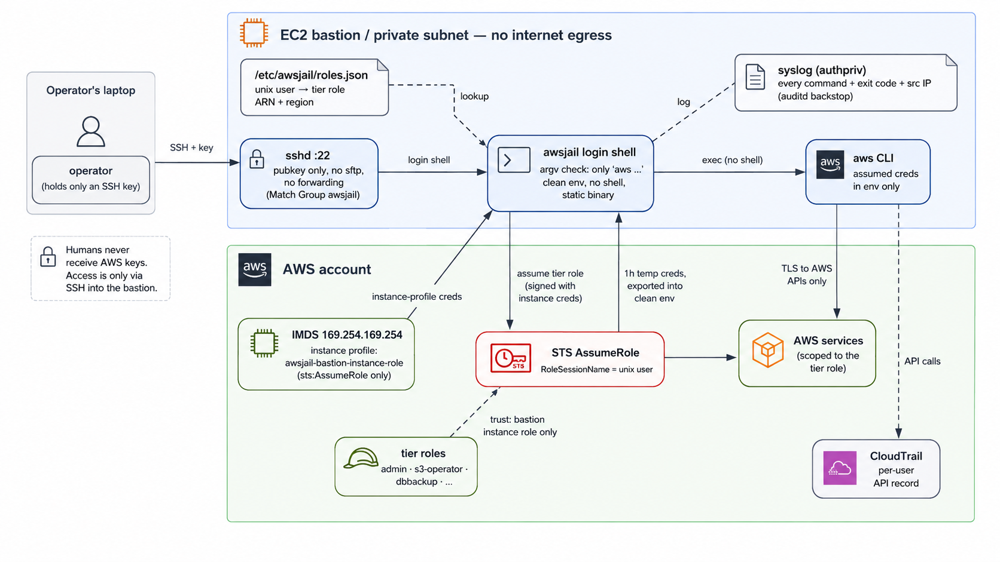

# awsjail

An aws-only login shell for SSH bastions. Scoped AWS CLI per user, the assumed-role STS credentials never intentionally exposed to the user, no internet access from the terminal, every command logged.

A login shell that only accepts AWS CLI commands. Users SSH in with a key, land at an `awsjail:<account-id>:<user> > ` prompt, and can run `aws ...` commands and nothing else. The box assumes the user's IAM role for them and does not hand the credentials over — the CLI's own credential-export command is blocked. Every command is logged.

## Contents

- [Why this exists](#why-this-exists)
- [Use cases](#use-cases)
- [How it works](#how-it-works)
- [Quick start](#quick-start)
- [Documentation](#documentation)
- [Reporting security issues](#reporting-security-issues)
- [References](#references)
- [License](#license)

## Why this exists

Every common way to hand out AWS CLI access has a catch.

Access keys end up in a dotfile, a git repo, a Slack DM. Once a key is on a laptop, you've lost track of where it goes.

CloudShell runs outside your account with open internet from the terminal. You can't stop egress there, and the environment isn't yours to log.

A full-shell bastion lets people roam the box and pivot to other hosts, and command logging dies the moment someone spawns a subshell.

awsjail gives each user exactly the `aws` access their tier allows, on a host with no egress, and logs every command where they can't get around it.

## Use cases

**Operators and on-call.** Give the platform team scoped `aws` against prod without handing out keys. Each person gets a tier and an SSH key.

**Contractors and vendors.** Someone needs `s3` and `logs` for two weeks. Add them to `roles.json` with a locked-down tier, drop their SSH key on the box, and pull it when they're done. CloudTrail shows exactly what they ran under `RoleSessionName`.

**Regulated environments.** When you need a command-level record of who ran what against AWS, awsjail is the choke point and CloudTrail is the corroborating record.

**Egress-controlled access.** You specifically don't want the terminal that runs `aws` to reach the internet. awsjail assumes egress is sealed at the network and makes sure the shell itself can't be turned into a way out.

**Training and labs.** Students run `aws` against a scoped account but can't wander the host or reach the internet.

## How it works



1. A user connects with their SSH key. sshd starts `awsjail` as their login shell.
2. `awsjail` reads the unix user and looks up that user's tier role in `/etc/awsjail/roles.json`.
3. It calls `aws sts assume-role` for that role with `RoleSessionName=<user>`, using the instance profile, and gets short-lived credentials.
4. Interactive, you land at `awsjail:<account-id>:<user> > `. Each line is split into argv and checked: only `aws` is accepted as the entry point (`help` is an alias for `aws help`), everything else is `command not found`. `aws` is exec'd directly with no shell, so `;`, `|`, `$()`, and backticks are literal arguments.
5. Non-interactive `ssh host "aws ..."` arrives as `-c` or `SSH_ORIGINAL_COMMAND` and goes through the same check, so there's no one-shot bypass.
6. The `aws` process runs in a clean environment (pager off, config and credentials files at `/dev/null`, only the assumed credentials, PATH restricted to an empty root-owned helper directory so CLI customizations can't invoke arbitrary system tools). Two events are logged per command — `command_start` before the CLI runs and `command_finish` with its exit code — with the user and source IP.

```
$ ssh dbbackup@bastion -i key
aws-only shell. only 'aws ...' is permitted. 'help' = aws help. type 'exit' to quit.
awsjail:123456789012:dbbackup > id
id: command not found (only 'aws' is permitted)
awsjail:123456789012:dbbackup > aws sts get-caller-identity
{
    "UserId": "AROA...:dbbackup",
    "Account": "123456789012",
    "Arn": "arn:aws:sts::123456789012:assumed-role/tier-dbbackup/dbbackup"
}
```

## Quick start

On an Ubuntu 22.04/24.04 host, as root, from a copy of this repo:

```
sudo ./setup.sh
```

Then onboard tier users with `awsjail-admin add-user`. Full details, manual
steps, and the sshd config: [docs/setup.md](docs/setup.md).

## Documentation

- [docs/setup.md](docs/setup.md) — build, host setup, `setup.sh`, the break-glass account, `awsjail-admin`, sshd hardening.
- [docs/iam.md](docs/iam.md) — credential model, the IAM policies for the instance and tier roles, and which AWS capabilities are deliberately left to IAM.
- [docs/security.md](docs/security.md) — logging layers, network requirements, traps the design handles, known limitations and caveats, and the v2 hardening roadmap.

## Reporting security issues

Open a PR via GitHub please! Contributions and enhancements welcome!

## References

- OpenSSH `sshd_config`, `ForceCommand` and the `restrict` key option: https://man.openbsd.org/sshd_config
- EC2 instance metadata (IMDS): https://docs.aws.amazon.com/AWSEC2/latest/UserGuide/ec2-instance-metadata.html
- AWS PrivateLink and VPC endpoints: https://docs.aws.amazon.com/vpc/latest/privatelink/
- STS AssumeRole and RoleSessionName: https://docs.aws.amazon.com/STS/latest/APIReference/API_AssumeRole.html
- AWS CLI User Guide (pager, config, and alias behavior): https://docs.aws.amazon.com/cli/latest/userguide/
- CloudTrail: https://docs.aws.amazon.com/awscloudtrail/latest/userguide/

## License

MIT. See [LICENSE](LICENSE).

---

Built by Riyaz Walikar. Build, Break, Repeat.

[ibreak.software](https://ibreak.software)

Happy hacking.
